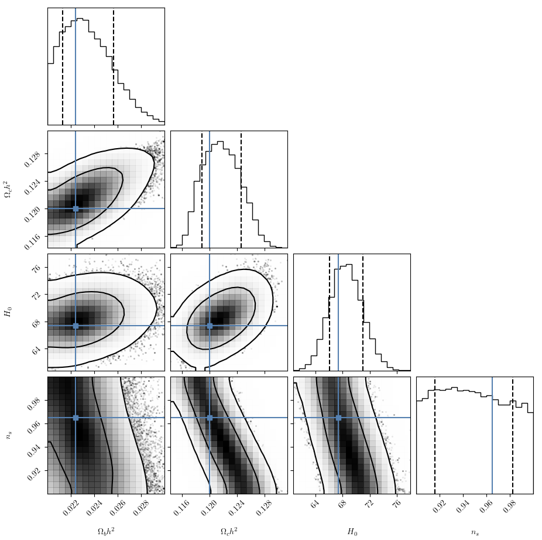

# Project Report: Fast Emulators for Cosmological analyses

## Abstract

This project develops a machine learning-based emulator for the Halo Mass Function (HMF), a critical observable in cosmology used to constrain dark matter, dark energy, and baryon parameters through large-scale structure surveys. Modern cosmological analyses require repeated evaluations of forward models—often thousands of times during Bayesian inference—which creates a significant computational bottleneck. To address this challenge, we implemented a **modular neural network emulator** that accelerates HMF predictions by a factor of 1,000 to 10,000 times while maintaining sub-percent accuracy.

## Methodology

The project evaluated two emulation strategies:

1. **Direct HMF Emulation** (Strategy 1): Attempted to model the complete HMF pipeline in one step, including non-linear baryonic physics. This approach failed to achieve the required accuracy due to the complexity of simultaneously modeling smooth mass variance behavior and sharp non-linear features.

2. **Modular Mass Variance Emulation** (Strategy 2 - Adopted): Decoupled the problem by focusing solely on predicting the mass variance $sigma_Mass$, which is inherently smoother and more stable. The predicted $sigma_Mass$ is then fed into an analytical Tinker08 solver to compute the final HMF.

### Data Generation

- **Parameter Sampling**: Used Latin Hypercube Sampling (LHS) to efficiently explore a 7-dimensional parameter space within the **wCDM** cosmological model.
- **Parameters**: Included physical cold dark matter density $\Omega_c h^2$, baryon density $\Omega_b h^2$, Hubble constant (H₀), scalar spectral index $n_s$, primordial scalar amplitude $A_s$, and dark energy parameters (w₀, $w_a$).
- **Training Data**: Generated power spectra using CAMB and computed mass variance vectors across a fixed mass grid (24 bins from 10¹¹ to 10¹⁶ M☉).

### Emulator Architecture

- **Neural Network**: Fully connected feed-forward network (3 hidden layers, ReLU activation, 24 output neurons).
- **Preprocessing**: Applied log-transform to $sigma_Mass$ output and StandardScaler normalization to all features.
- **Training**: Used Adam optimizer with Mean Squared Error loss, early stopping, and batch size of 100 over up to 800 epochs.

## Results

### Performance Metrics

- **Mean Relative Error**: Below 0.5% across the entire parameter space, satisfying stringent requirements for unbiased parameter constraints.
- **Speedup Factor**: Achieved 10³–10⁴× speedup compared to running the full analytical pipeline.
- **Runtime**: Complete MCMC chains with 64,000 samples complete in approximately 2–4 hours on a standard workstation (vs. 6–9 days with the original code).

### MCMC Application

The trained emulator was successfully embedded in a Bayesian inference pipeline using the `emcee` sampler to recover cosmological parameters from mock observational data. Posterior samples and corner plots confirmed that recovered parameter constraints are consistent with the input cosmology, validating the emulator's reliability for scientific applications.

## Key Innovations

- **Physics-Aware Design**: Incorporated physical scaling relations for redshift (z) and primordial amplitude $A_s$, extending emulator applicability beyond the training parameter space.
- **Modular Architecture**: Decoupled complex physics into manageable components, focusing machine learning on the most stable intermediate quantity.
- **Custom Analytical Solver**: Implemented a custom Tinker08 M₅₀₀c solver instead of relying on external libraries, ensuring full control and reproducibility of the physics pipeline.

## Conclusions

This project demonstrates that machine learning emulators can efficiently replace slow analytical codes for HMF evaluations while maintaining high precision and physical fidelity. The modular approach successfully overcomes the challenges of high-dimensional, non-linear emulation by strategically decoupling the problem.

The achieved speedup—reducing MCMC inference from days to hours—transforms cosmological parameter inference from a computationally prohibitive task into a routine analysis feasible on standard workstations. This opens pathways for future extensions, including:

- Incorporation of Sunyaev-Zeldovich observables
- Integration into large-scale cosmological survey pipelines
- Exploration of alternative ML architectures (e.g., Gaussian Processes, CNNs)
- Validation on realistic survey data with systematic uncertainties

---

## References

The internship was conducted at the Institut d'Astrophysique Spatiale (IAS), CNRS, Université Paris-Saclay, under the supervision of Dr. Marian Douspis and Prof. Hoel Le Capitaine (July–October 2025).
